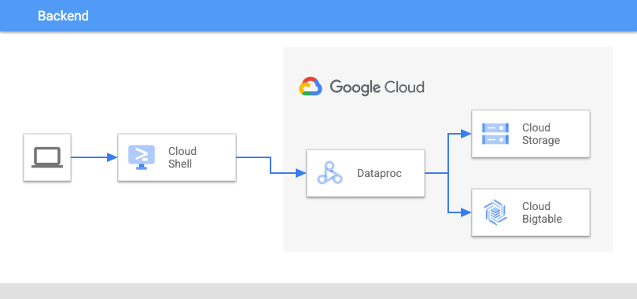

# gcp-hbase-to-bigtable-migration-template

----

## Table Of Contents

1. [Use Case](#use-case)
2. [About](#about)
3. [Architecture](#architecture)
4. [Guide](#guide)

----

## use-case

Migrate HBase tables to [Cloud Bigtable](https://cloud.google.com/bigtable).

----

## about

This repository contains a tutorial with accompanied code that allows a user to migrate HBase tables to Cloud Bigtable.  Provides step-by-step guide for spinning up a [Cloud Dataproc](https://cloud.google.com/dataproc) Cluster, creating a sample HBase table with public data, creating an HBase Snapshot and uploading to [Google Cloud Storage](https://cloud.google.com/storage), and running a Dataproc job to migrate the HBase Snapshot data to Cloud Bigtable.

This is poised as an alternative to the suggested [Cloud Dataflow HBase Migration guide](https://cloud.google.com/architecture/hadoop/hadoop-gcp-migration-data-hbase-to-bigtable).

----

## architecture




----

## guide

### 1. set environment variables

**cloud shell**

```bash
#Google Cloud
export PROJECT_ID=""
export PROJECT_NUMBER=""
export REGION=""
export ZONE=""
export DATAPROC_CLUSTER_NAME="dp-cluster"
export BIGTABLE_INSTANCE_NAME="bt-instance"

export TABLE_NAME=car_data

export BUCKET_NAME="$PROJECT_ID-bucket"
export GCS_SNAPSHOT_DIR="gs://$BUCKET_NAME/snapshots/"
export GCS_MIGRATION_DIRECTORY="$GCS_SNAPSHOT_DIR/$TABLE_NAME"
export GCS_TEMP_DIR="gs://$BUCKET_NAME/tmp/"

# import tool
export IMPORT_JAR=target/hbase-migration-0.0.1-SNAPSHOT.jar

#HBase
export SNAPSHOT_NAME=$TABLE_NAME-snapshot
export ZOOKEEPER_QUORUM=$DATAPROC_CLUSTER_NAME-m
export ZOOKEEPER_PORT=2181
export ZOOKEEPER_QUORUM_AND_PORT="$ZOOKEEPER_QUORUM:$ZOOKEEPER_PORT"
export HDFS_PATH=hbase/
```

### 2. configure project

**cloud shell**

```bash
gcloud config set project $PROJECT_ID
sudo apt-get install google-cloud-sdk-cbt

gcloud services enable storage-component.googleapis.com 
gcloud services enable compute.googleapis.com  
gcloud services enable servicenetworking.googleapis.com 
gcloud services enable iam.googleapis.com 
gcloud services enable dataproc.googleapis.com
gcloud services enable cloudbilling.googleapis.com
gcloud services enable cloudbuild.googleapis.com
gcloud services enable logging.googleapis.com
gcloud services enable pubsub.googleapis.com
gcloud services enable bigtable.googleapis.com

echo "===================================================="
echo " Setting external IP access ..."

echo "{
  \"constraint\": \"constraints/compute.vmExternalIpAccess\",
	\"listPolicy\": {
	    \"allValues\": \"ALLOW\"
	  }
}" > external_ip_policy.json

gcloud resource-manager org-policies set-policy external_ip_policy.json --project=$PROJECT_ID
```

### 3. build infrastructure

**cloud shell**

```bash
gsutil mb gs://$BUCKET_NAME

cbt createinstance $BIGTABLE_INSTANCE_NAME $BIGTABLE_INSTANCE_NAME $BIGTABLE_INSTANCE_NAME-c1 $ZONE 3 SSD

cbt -instance $BIGTABLE_INSTANCE_NAME deletetable $TABLE_NAME
cbt -instance $BIGTABLE_INSTANCE_NAME createtable $TABLE_NAME
cbt -instance $BIGTABLE_INSTANCE_NAME createfamily $TABLE_NAME cf1

gcloud beta dataproc clusters create $DATAPROC_CLUSTER_NAME \
--enable-component-gateway \
--service-account=$PROJECT_NUMBER-compute@developer.gserviceaccount.com \
--region $REGION --subnet default --zone $ZONE \
--master-machine-type n1-standard-4 --master-boot-disk-size 500 \
--num-masters 1 \
--num-workers 5 --worker-machine-type n1-standard-4 \
--worker-boot-disk-size 500 --image-version 1.5-debian \
--project $PROJECT_ID \
--optional-components "HBASE,ZOOKEEPER" \
--properties yarn:yarn.log-aggregation-enable=true,hbase:hbase.hregion.majorcompaction=0,dataproc:dataproc.logging.stackdriver.job.driver.enable=true,dataproc:dataproc.logging.stackdriver.enable=true,dataproc:jobs.file-backed-output.enable=true,dataproc:dataproc.logging.stackdriver.job.yarn.container.enable=true,dataproc:dataproc.scheduler.max-concurrent-jobs=50
```

### 4. ssh into dataproc cluster and create hbase resources

**dataproc cluster terminal**

tip: use the environment variables above.

```bash
echo "create '$TABLE_NAME', {NAME => 'cf1'}" | hbase shell -n

wget https://perso.telecom-paristech.fr/eagan/class/igr204/data/cars.csv

hdfs dfs -mkdir /user/data
hdfs dfs -copyFromLocal cars.csv /user/data/cars.csv

hbase org.apache.hadoop.hbase.mapreduce.ImportTsv -Dimporttsv.separator=';' -Dimporttsv.columns=HBASE_ROW_KEY,cf1:car,cf1:mpg,cf1:cylinders,cf1:displacement,cf1:horsepower,cf1:weight,cf1:acceleration,cf1:model,cf1:origin car_data /user/data/cars.csv

echo "snapshot '$TABLE_NAME', '$SNAPSHOT_NAME'" | hbase shell -n

hbase org.apache.hadoop.hbase.snapshot.ExportSnapshot -Dhbase.zookeeper.quorum=$ZOOKEEPER_QUORUM_AND_PORT -snapshot $SNAPSHOT_NAME -copy-from hdfs:///$HDFS_PATH -copy-to $GCS_MIGRATION_DIRECTORY
```

### 5. build the migration tool

**cloud shell**

```bash
git clone https://github.com/CYarros10/gcp-hbase-to-bigtable-migration-template.git
cd gcp-hbase-to-bigtable-migration-template
mvn clean compile package -DskipTests
```

### 6. create the cloud bigtable resources

**cloud shell**

```bash
cbt -instance $BIGTABLE_INSTANCE_NAME deletetable $TABLE_NAME
cbt -instance $BIGTABLE_INSTANCE_NAME createtable $TABLE_NAME
cbt -instance $BIGTABLE_INSTANCE_NAME createfamily $TABLE_NAME cf1
```

### 7. submit the migration jobs to dataproc

**cloud shell**

```bash
gcloud dataproc jobs submit hadoop \
   --project ${PROJECT_ID} \
   --cluster ${DATAPROC_CLUSTER_NAME} \
   --region ${REGION} \
   --jar ${IMPORT_JAR} \
   -- \
   import-snapshot \
   -Dgoogle.bigtable.project.id=${PROJECT_ID} \
   -Dgoogle.bigtable.instance.id=${BIGTABLE_INSTANCE_NAME} \
   ${SNAPSHOT_NAME} \
   "${GCS_SNAPSHOT_DIR}${TABLE_NAME}" \
   ${TABLE_NAME} \
   ${GCS_TEMP_DIR}
```
